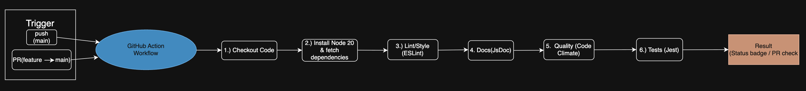

# Phase 1 Pipeline Status

## Overview

We aimed to set a solid foundation for our pipeline in this first phase, focused on automating quality assurance and making collaboration as smooth as possible. We implemented it with GitHub Actions, supporting the following functionalities

Linting and code style enforcement (ESLint)
Automated unit testing (Jest)
Code quality via external tool (to be decided)
Code quality via human review through pull requests
Documentation generation (JSDoc)
Isolated experimentation with feature branches

## What’s functional

### Linting & Style Enforcement

- **Tool We Used:** ESLint
- **Setup:** `eslint.config.mjs` is configured and runs automatically in the pipeline while ignoring other libraries like JSDoc and Jest.
- **Execution:** Triggered on every push and pull request to enforce code quality through lint.yml.
- **Editor Integration:** We added VSCode integration for ESLint to make style enforcement easier.

### Code Quality via PR Reviews

- We enabled branch protection rules for main branch so pull requests must be made and at least 1 reviewer must review them before merging

### Automated Unit Testing

- **Tool Used:** Jest
- **Setup:** Tests located under the `/tests` directory, only have one right now as an example.
- **Execution:** Jest runs as part of the GitHub Actions workflow in tests.yml. Failing tests will block merges.

### Auto Documentation

- **Tool Used:** JSDoc
- **Setup:** Configured through jsdoc.json to generate HTML documentation while ignoring dependencies and tests
- **Execution:** Runs in pipeline through docs.yml and outputs HTML docs to `/docs` directory.

## In Progress

### Implementing more Jest test cases

We are in the process of implementing more Jest test units that correlate with our js code instead of template test cases. 

For example, we would have tests for specific functions within our project.

### Setting up feature branches

The branching system has not yet been developed yet as the official project has not yet started.

Once we begin coding, we will start utilizing more branches.

## What we still need to implement

Code quality via Code Climate or Sonar Cloud. Reason being it helps us enforce consistent coding standards, identify refactoring opportunities, reduces bugs caused by complex or duplicate code and monitors long-term health of your codebase.